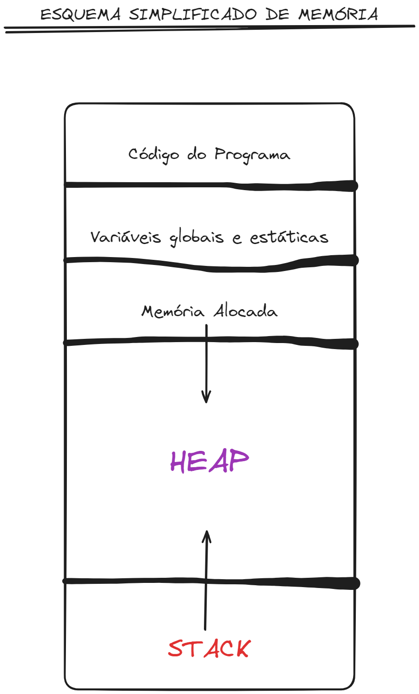
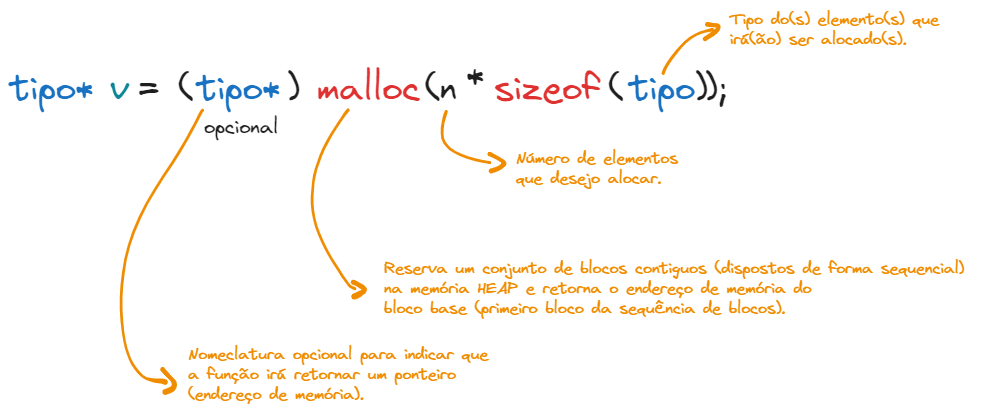
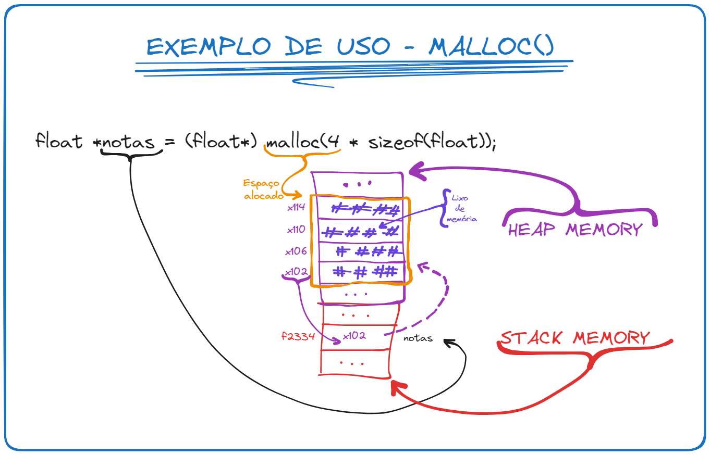
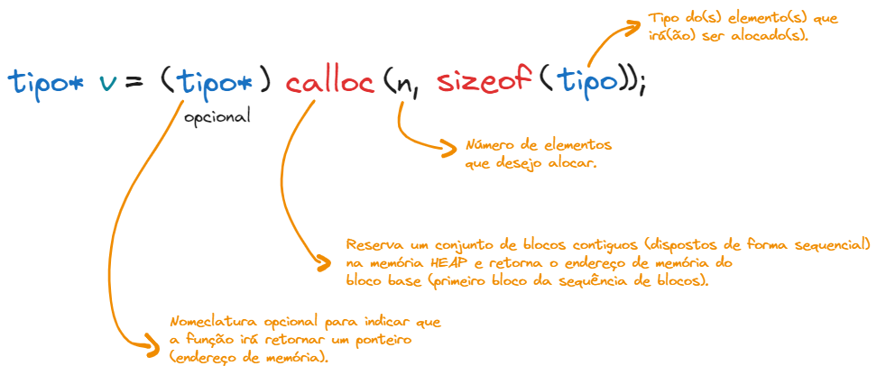

# Esquema de Memória



# Alocação Estática em C

* Volumes fixos de armazenamento;

* O espaço de armazenamento para as variáveis é reservado no **início da execução**;

* Cada variável tem seu **endereço** fixado e a área de memória ocupada por ela se **mantém constante** durante **toda a execução**;

* São alocadas na **STACK** da Memória RAM;

* **Liberação** de memória feita **automaticamente** pelo **compilador**;

* **Toda** variável é alocada na memória STACK;

**Exemplos:**

```
int a;
float b;
char c;
int a[10];
float *p;
```

# Alocação Dinâmica em C

* Volumes dinâmicos de armazenamento;

* O espaço é alocado dinamicamente **durante a execução do programa**;

* Pode ser criada ou eliminada durante a **execução do programa**, ocupando espaço na memória **apenas** enquanto está sendo utilizada.

* São alocadas na **HEAP (free store)** da Memória RAM;

&nbsp;

* Liberação de memória feita **manualmente** pelo **programador**. **PERIGO!**

**Exemplos:**

```
int *a = (int *) malloc(10 * sizeof(int));
float *b = (float *) calloc(5, sizeof(float));
free(a);
free(b);
```

## Por que usar a Alocação Dinâmica?

* A **alocação dinâmica** é o processo que aloca memória em **tempo de execução**;

* Ela é utilizada quando não se sabe ao certo **quanto de memória será necessário** para o armazenamento dos elementos;

* Assim, o tamanho de memória necessário é determinado conforme necessidade;

* Dessa forma evita-se o desperdício de memória;

* Além disso, **size(HEAP) >> size(STACK)**;

## Memory Allocation - malloc()

A função ***malloc()*** aloca um **bloco de bytes consecutivos** na **memória HEAP** e devolve o endereço desse bloco.



**Exemplo:**



## calloc()

A função ***calloc()*** aloca um **bloco de bytes consecutivos** na **memória HEAP** e inicializa todos os valores com **0 (zero)** - ou **NULL**, no caso de ponteiros, diferentemente do ***malloc()*** que deixa o lixo de memória nos blocos reservados.

