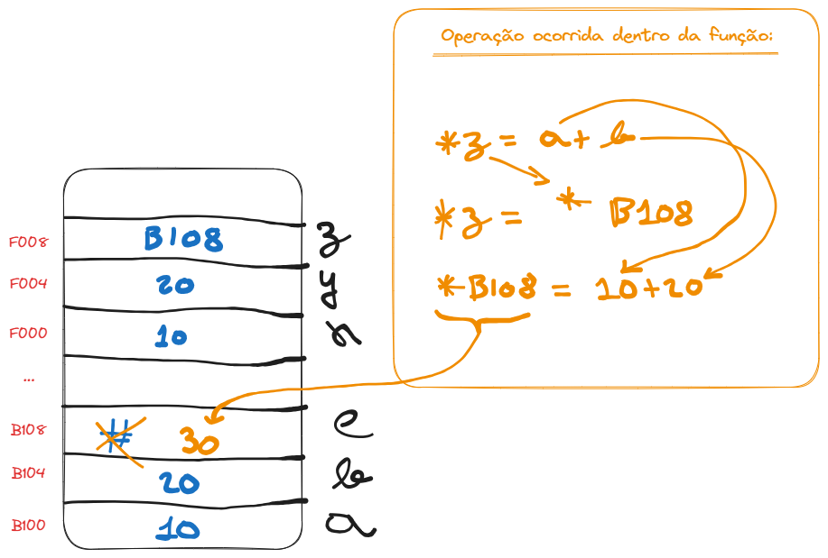

# Funções (Passagem por Referência)

É passada a referência de uma variável (ponteiro) para a função, possibilitando alterar uma variável que é exterma a uma função.

```
void soma (int x, int y, int *z)
{
    *z = x + y;
}

int a = 10;
int b = 20;
int c;

soma(a,b, &c);
```



É bastante útil para retorno múltiplo de valores por via de uma única função. No exemplo abaixo, um valor inteiro é retornado e a variável "contador" também tem seu valor alterado na mesma chamada da função, observe:

```
#include <stdio.h>

int soma_e_subtracao (int x, int y, int *cont)
{
    if (*cont>0)
    {
        *cont -= 1;
        return x + y;
    }
    
    return 0;
}

void main()
{
    int contador = 3;
    int a = 10;
    int b = 20;
    int c = 0;

    c += soma_e_subtracao(a, b, &contador);
    c += soma_e_subtracao(a, b, &contador);
    c += soma_e_subtracao(a, b, &contador);
    c += soma_e_subtracao(a, b, &contador);
    c += soma_e_subtracao(a, b, &contador);

    printf("%d", c);
}
```