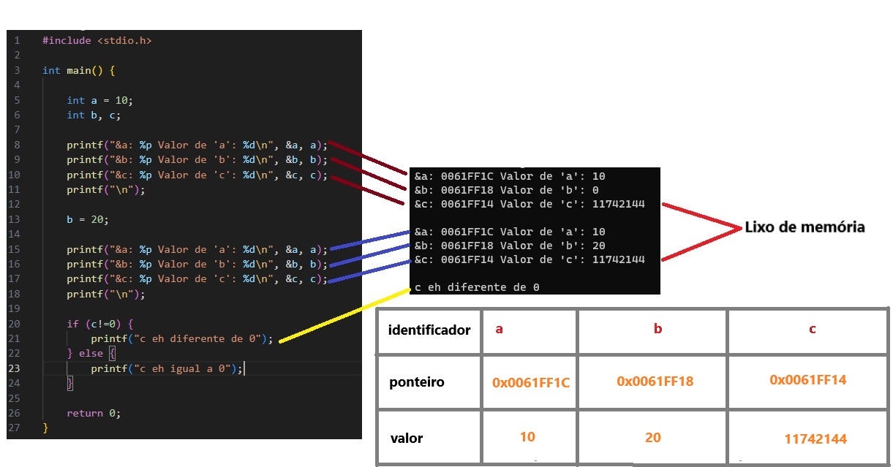

# Variáveis, referência na memória e valores

 

No exemplo acima, vemos que os ponteiros foram ordenamos de forma decrescente - dependendo do sistema operacional, esse ordenamento pode vir a ser crescente - tendo como ponto de partida o endereço de memória da variável 'a'.

A diferença de 4 Bytes entre os endereços de memórias se deu em decorrência do espaço de armazenamento do tipo primitivo 'int' em C, que ocupa 4 Bytes de memória.

A variável 'c' foi ocupada por um **lixo de memória**. Isso se dá, porque basicamente em programação, podemos criar uma variável - reservar um espaço na memória - sem inicializa-la - atribuir um valor -, e quando fazemos isso, esse espaço de memória reservado pode já ter sido ocupado por outro valor - lixo de memória - ou não.

Algumas linguagens, python por exemplo, ao criarmos uma variável sem atribuir a ela nenhum valor, já pré inicializam as variáveis para o programador, atribuindo às variáveis algum valor padrão para o tipo de variável em uso. Mas tendo em vista, que essa pré-inicialização é uma atividade a mais, certas linguagens como C, deixam o volante e responsabilidade na mão do programador e não pré-inicializam as variáveis. Sendo assim, programador e programadora, cuidado com o uso de suas variáveis criadas e não inicializadas.