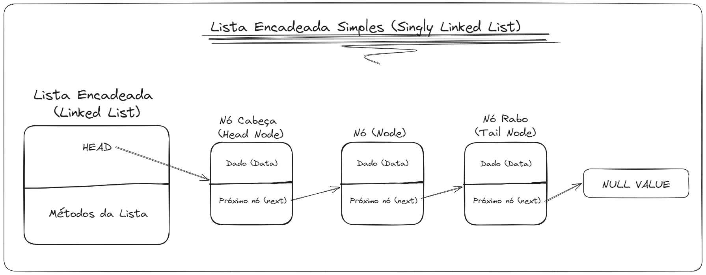
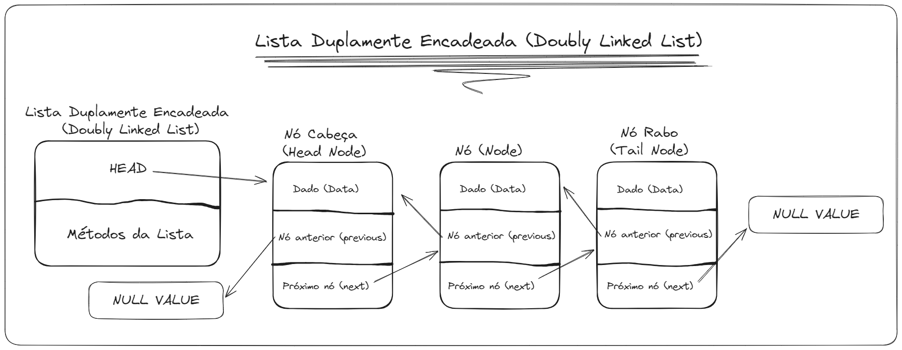
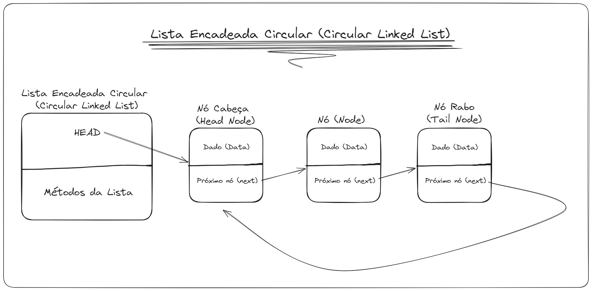
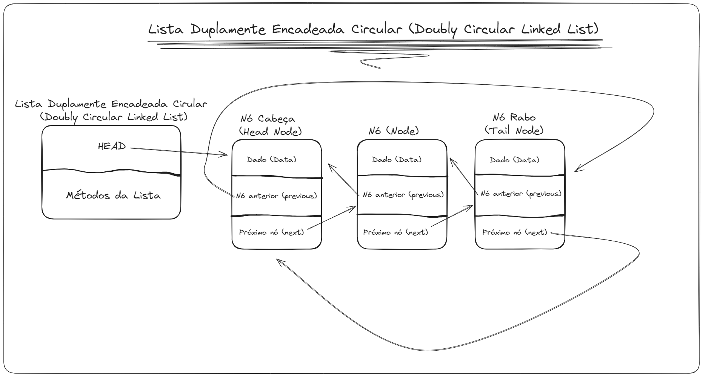

# Listas Encadeadas (Linked List)

"Listas encadeadas são provavelmente as estruturas de armazenamento de dados de uso geral mais usadas depois de vetores." (Lafore, 2004)

Uma lista encadeada é uma "estrutura de dados composta de nós, cada nó contendo alguma informação e um ponteiro para outro nó na lista. [...] O último nó na lista pode ser reconhecido pelo ponteiro nulo." (Drozdek, 2016)

Uma lista encadeada é uma estrutura de dados linear composta por nós conectados, cada nó possui um item de informação da lista encadeada e uma referência para um próximo nó da lista, onde o último nó da lista referencia um valor nulo.

O primeiro nó da lista é denominado ***Head*** (cabeça) e o último é denominado ***Tail*** (rabo).

### Nó (Node)

Um nó é um objeto que armazenam um item de uma lista encadeada, além de armazenar as possíveis referências para outros nós.

"Em uma lista encadeada, cada item de dados é incorporado em uma nó. [...] Um campo da própria lista contém uma referência para o primeiro nó." (Lafore, 2004)

## Tipos de Listas Encadeadas

Existem três tipos listas encadeadas.

### Lista Encadeada Simples (Singly Linked List)

Em uma lista encadeada simples, podemos percorrer os itens de uma lista somente em uma direção, devido à forma com que cada nó da lista se conecta (por referenciamento) somente ao seu nó sucessor.

Sendo assim, cada nó da lista encadeada possui apenas uma referência para outro nó.

### Lista Duplamente Encadeadas (Doubly Linked List)

Em uma lista duplamente encadeada, podemos percorrer os itens da lista em em duas direções, devido à forma com que cada nó da lista se conecta (por referenciamento) ao seu nó antecessor e sucessor.

Sendo assim, cada nó da lista encadeada possui duas referências para outros nós.

### Listas Encadeadas Circulares (Circular Linked List)

Em uma lista encadeada cirucular, podemos percorrer os itens da lista em loop, devido à forma com que cada nó da lista se conecta (por referenciamento) ao seu sucessor (ou antecessor e sucessor), e o último nó da lista aponta para o primeiro nó da lista (head) em vez de referenciar um valor nulo.

## Ordenamento

É importante ressaltar que os três tipos de listas encadeadas podem ser ordenadas ou não de acordo com a maneira que forem implementadas, e que isso pode resultar no ganho ou perca de performance de execução a depender do fim de uso de cada uma.

## Interface de Operação

A interface de operação de uma lista encadeada pode variar dependendo da linguagem que a implemente, porém as operações mais adotadas são:

### add(index, element)

Adiciona um elemento em um dado index da lista encadeada.

### addFirst(element)

Adiciona um dado elemento na primeira posição da lista encadeada.

### addLast(element)

Adiciona um dado elemento na última posição da lista encadeada.

### remove(index)

Remove e retorna um elemento em uma dada posição da lista da lista encadeada.

### remove(element)

Remove e retorna a primeira ocorrência de um dado elemento na lista encadeada.

### removeFirst()

Remove e retorna o primeiro elemento da lista encadeada.

### removeLast()

Remove e retorna o último elemento da lista encadaeada.

### isEmpty()

Retorna verdadeiro se nenhum elemento esteja armazenado na lista encadeada, e falso caso esteja.

### clear()

Remove todos os elementos da lista encadeada, deixando a lista vazia.

### search(element)

Pesquisa um dado elemento na lista encadeada, retornando verdadeiro caso o elemento esteja armazenado ou falso caso o contrário.

### size()

Retorna o tamanho (quantidade de elementos armazenados) da lista encadeada.

## Referência

* [Listas Encadeadas (linked lists)](Anexos/09-listas-encadeadas.pdf) - [Prof. MSc. Ricardo Nunes](https://www.escavador.com/sobre/5594419/ricardo-rubens-gomes-nunes-filho)

* [Listas Encadeadas Ordenadas](Anexos/10-listas-encadeadas-ordenadas.pdf) - [Prof. MSc. Ricardo Nunes](https://www.escavador.com/sobre/5594419/ricardo-rubens-gomes-nunes-filho)

* Estruturas de Dados e Algorítmos em Java (Tradução da 2ª Edição) - Robert Lafore

* Estrutura de Dados e Algorítmos em C++ (Tradução da 4ª Edição norte americana) - Adam Drozdek

* [Linked List](https://www.scaler.com/topics/linked-list/)

* [Listas - REA-AED](https://gabrielbueno072.github.io/rea-aed/aula_list.html)

* [Estrutura de Dados com Java | Lista Encadeada | Introdução - Loiane Groner](https://youtu.be/RW0oD2L_tSg?si=ZOhCD_G8ls-FWate)